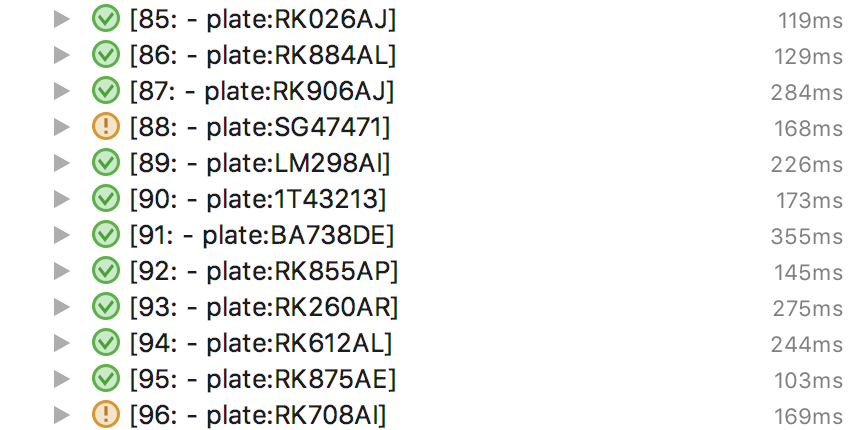

# Test assignment 6
## Project 1
### Test resuts:

### Code:
The code can be found in "./RecognitionAllIt.java"

### Questions:
- Explain the purpose of the Test (what the original test exposed, and what your test exposes):  
The original test was made to determine if the program could recognize all the plates, and failing if there is one that isn't correct. The new tests creates a test for each of the test images, and shows specificly which plates fail.

- Explain about Parameterized Tests in JUnit and how you have used it in this exercise:  
Parameterized tests in JUnit is like creating a new test for each of parameter sets in a collection. This makes it easy to do a lot of tests, with less code. I my test i have a collection, with sets of the input file(the image) and the correct result (plate string). So each test can access the test image and what the result should be.

- Explain the topic Data Driven Testing, and why it often makes a lot of sense to read test data from a file:  
Data Driven Testing is the practise of testing from at table of data, with parameters or conditions, and what the result should be. These tests can be good for doing a lot of tests with ease, and is also very appropriate for testing equivalence classes.

- Your answers to the question; whether what you implemented was a Unit Test or a JUnit Test, the problems you might have discovered with the test and, your suggestions for ways this could have been fixed:  
This is a JUnit test, because we've used JUnit (4.12), and it is not a unit test because these tests doesn't test a very small part of the program. it actually tests the entire main functionality of the project. Making smaller methods and testing those might help, because if just look into the `.recognize()`, we see a method that definitely has a very high CC.

- The steps you took to include Hamcrest matchers in the project, and the difference they made for the test:  
I added the dependency to the pom.xml file, ran maven and the changed the matchers to hamcrest asserters. I didn't think made a difference reading the tests, the JUnit matchers very already pretty descriptive, and no real need for complex matching.

## Project 2
### Test resuts:
...

### Code:
The code can be found in "./jokeFetcher/..."

### Questions:
- Explain the necessary steps you did to make the code testable, and some of the patterns involved in this step:  
Used dependency injection, so i could inject a mocked object to return a specific value.

- Execute your test cases:  

- Explain basically about JUnit, Hamcrest, Mockito and Jacoco, and what problems they solve for testers:  
Java doesn't have testing tools out of the box, so JUnit provides a testing framework, to write simple and complex tests with basic assertions.  
Hamcrest is a matcher framework, to be used on top of JUnit for example. It provides more specific matchers, and more powerful ones, that are also more "readable".  
Mockito is used to create mocks and stubs of objects, to mock away some functionality from an object, og make a method return a specific value.

- Demonstrate how you used Mockito to mock away external Dependencies:  

- Demonstrate how/where you did state-based testing and how/where you did behaviour based testing:  

- Explain about Coverage Criterias, using the results presented by running Jacoco (or a similar tool) against you final test code:  
IntelliJ comes with coverage tool, example:

Some criterias should be that, all classes should be tested and atleast 80% of the methods and lines of code. some code may be unnecessary to test if they serve a very basic of untestable feature. The code coverage doesn't proove the quality of the tests. The tests could have been written to run as the program was intended, and not testing bad inputs etc., so the coverage can be misleading.

- Explain/demonstrate what was required to make this project use, JUnit (Hamcrest), Mockito and Jacoco:  
Adding the libraries to the pom.xml file, importing the libraries and using them?

## Project 3

### Code:
The code can be found in "./monopoly.go" and "./monopoly_test.go"

### Questions:
- Explain your solution with focus on its design. Does it have low coupling, interfaces, polymorphism, Inversion of Control and Dependency injection as central design principles? If not, why? Otherwise, demonstrate it!

- Explain your test case design activity and argument for the choices that you have made:  

- how to choose the right test conditions (i.e. what to test which in principle will be all code when you are a TDD’er)?  

- what test design techniques to use (both consider black-box techniques and white-box technique)?  

- how much effort to put into each test condition (how critical is the item will influence it’s test coverage percentage)?  

