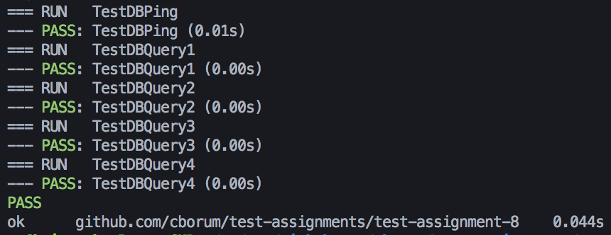

# Test assignment 8
## Plan
The purpose of this integration test, is to integrate a database with a module and test that this module serves its purpose.
The plan used for this project was the Big Bang Approach, because the size of this project is very small. 
One of the disadvantages is that all modules are tested at the same time, and that can cause unexpected problems which may be harder to locate.  
This project is made by extending another exercise by implementing the queries in a programming language, and testing that we get the same results. 

## Test cases
|Test Case| Test case description | Expected results |
|---|---|---|
| 1 | Test that the query that should return tracks with the genreid 18 & 20 works correctly | Expect the length to be 39, and the id of the last item 3237 |
| 2 | Test that the query that should return invoices that are cheaper than 10 dollars and the invoices that are more expensive than 5 dollars works correctly | Expect the length to be 115 and the id of the last item is 319 |

## Setup
`docker run -p 5432:5432 --name data -d jegp/soft2018-data`

## Result

